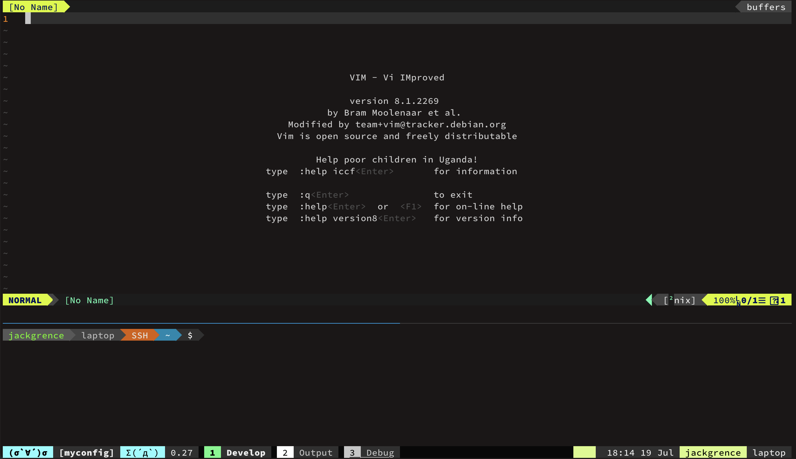

# My dotfiles



## Installation

* Python3.11 or above

```
git clone https://github.com/JackGrence/dotfiles.git
cd dotfiles
./setup.py
```

## Usage

```
usage: setup.py [-h] [-m {install,update,diff}] [-p PLATFORM] [-c CONFIG]

Manage dotfiles.

options:
  -h, --help            show this help message and exit
  -m {install,update,diff}, --mode {install,update,diff}
                        install: Install the config for first setup (default) | update: Copy the config files to home directory | diff: Copy the config files back from home directory
  -p PLATFORM, --platform PLATFORM
                        platform name (default: host platform)
  -c CONFIG, --config CONFIG
                        config folder (default: all from config.toml)
```
