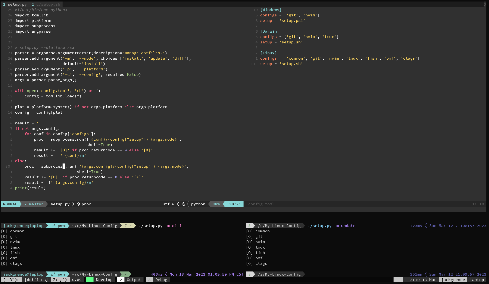

# My dotfiles



## Installation

* Python 3.11 or above (required for `tomllib`)

```bash
git clone https://github.com/JackGrence/dotfiles.git
cd dotfiles
./manage.py install
```

## Usage

```bash
usage: manage.py [-h] {install,link,status} [packages ...]

Manage dotfiles.

positional arguments:
  {install,link,status}
                        install: Install packages and link configs (default)
                        link: Only link configs
                        status: Show status (not implemented)
  packages              Specific packages to process (optional)

options:
  -h, --help            show this help message and exit
```

Examples:
```bash
# Install all enabled packages
./manage.py install

# Install only git and nvim (and their dependencies)
./manage.py install git nvim

# Link only fish
./manage.py link fish
```

## Configuration

Configuration is managed in `dotfiles.toml`.

### Enabling Packages
You can define which packages are enabled by default in the `[config]` section:

```toml
[config]
enabled = ["git", "nvim", "fish"]
```

### Adding Packages
You can add new packages, dependencies, and link targets in the `[packages]` section.
